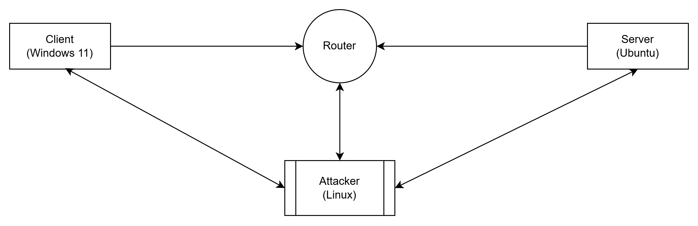

# 🛡️ Lab Report

Lab by Maxim Mudryak

This project demonstrates a **Man-in-the-Middle (MitM)** attack within a virtualized environment. By utilizing **ARP Spoofing**, we redirect traffic between a client and a server through an attacker’s machine to intercept sensitive data.

**Tools Used**: Wireshark, Nmap, `arpspoof`, nginx, Hyper-V (for VM management).

## 1. Initial Infrastructure Layout

The environment consists of three Virtual Machines (VMs) connected to a single **Private Virtual Switch** to ensure network isolation during the attack simulation.

- **Client**: Windows 11
- **Server**: Ubuntu (Running Nginx & SSH)
- **Attacker**: Kali Linux

To facilitate traffic interception in a virtualized environment, specific Hyper-V and OS-level settings were applied:

### ⚙️ Hyper-V Advanced Settings

- **Port Mirroring**:
    - **Source**: Client & Server
    - **Destination**: Attacker (Kali Linux)
    - *Purpose*: Allows the attacker to capture baseline traffic before the poisoning begins.

Each machine was manually assigned an IP address within the `172.22.245.x/16` range to ensure consistent connectivity.

### Kali Linux (Attacker)

To set the IP and bring the interface up:

sudo ifconfig eth0 <ip address>pin

### Windows 11 (Client)

Configured via **Settings > Network & Internet > Ethernet**:

- **IP assignment**: Manual
- **IPv4 address**: `172.22.245.100`
- **Subnet prefix length**: `16` (255.255.0.0)

| VM     | IPv4 address     | MAC              | Gateway (when not isolated) | Listening ports                         | Notes                                      |
|--------|------------------|------------------|-----------------------------|-----------------------------------------|--------------------------------------------|
| Client | 172.22.245.100   | 00:15:5d:38:01:02| 172.22.240.1                | 4, 1036, 1180, 1216, 1480, 2564, 3136, 3180, 3984, 5852 | ipconfig, arp -a, netstat -rn, netstat -aon |
| Kali   | 172.22.245.120   | 00:15:5d:38:01:01| 172.22.240.1                | –                                       | ip addr, arp -n, ip r, ss -tuln            |
| Server | 172.22.245.110   | 00:15:5d:38:01:03| 172.22.240.1                | 22, 53, 80, 631, 3350                   | ip addr, ip r, ss -tuln                    |

**Installation and Configuration:**
I set up the Nginx web server and SSH on the Ubuntu VM by running these commands:

1. **Update the local package index:**`sudo apt update`
2. **Install the OpenSSH server and Nginx packages:**`sudo apt install -y openssh-server nginx`
3. **Enable and immediately start the SSH service:**`sudo systemctl enable --now ssh`
4. **Enable and immediately start the Nginx service:**`sudo systemctl enable --now nginx`

**Service Verification:**
I checked that everything was installed and running correctly by looking at the service statuses:

**Web Server Baseline:**
To make sure the server was working, I created a simple "Ubuntu Web OK" test page with this command:

`echo "<h1>Ubuntu Web OK</h1>" | sudo tee /var/www/html/index.html`

**Remote Connectivity Testing:**
I tested the connection by logging into the Ubuntu server from the Windows client using SSH:

`ssh <username>@<server_ip_address>`

This step confirms that the SSH service is properly configured to accept incoming connections and that the network path between the client and server is open.

To verify the network communication, I sent an HTTP request from the client VM to the server VM. At the same time, I used Wireshark on the attacker VM to capture and monitor the traffic passing between them.

Next I stablished an SSH connection between the client and the server while capturing the traffic on the attacker VM using Wireshark:

Afterwards I used the attacker VM to perform an Nmap scan of the server VM, identifying open ports and active services.

As expected, the scan shows that the server has OpenSSH running on port 22 and Nginx on port 80. This aligns with the `ss -tuln` output from the server, confirming that these ports are open and listening on the server's IPv4 address.

Before beginning the ARP spoofing checkpoints for each VM were created:

To simulate a more realistic environment for the ARP spoofing attack, port **mirroring was disabled**.

To prepare for the attack, I enabled IP forwarding on the Kali VM using the following commands:

`echo "net.ipv4.ip_forward = 1" | sudo tee /etc/sysctl.d/99-ipforward.conf`
`sudo sysctl --system`

This configuration was necessary to allow the Kali VM to act as a bridge, forwarding intercepted packets to their original destinations to prevent a connection breakdown during the spoofing process.

Before proceeding with the ARP spoofing attack, I documented the legitimate MAC addresses for both the Client and Server VMs to ensure they could be verified and restored later.

## 2. MitM Attack

Next I started two `arpspoof` processes. The first one informs the client that the server's IP address is now associated with the Kali machine's MAC address:

The second process informs the server that the client's IP address is now associated with the Kali machine's MAC address:

Following this I checked the ARP tables on both the client and server VMs to confirm the attack worked. Each machine now shows the other's IP address linked to the attacker’s MAC address instead of the real one.

This confirms the Man-in-the-Middle position is active, as both VMs are now sending their traffic directly to the attacker.

Wireshark capture shows the following signs of spoofing for the first process:

And the following for the second:

While these processes were running, I sent an HTTP request from the client to the server and established an SSH connection. The Wireshark capture shows both types of traffic being intercepted by the attacker VM.

The following are the spoofed HTTP packets:

And this are the spoofed SSH packets:

Observation on Encryption: Although the ARP spoofing was successful for both protocols, the impact was different:

HTTP (Port 80): Because HTTP sends traffic in cleartext, the intercepted packets reveal the full content of the communication (e.g., the HTML code or credentials).

SSH (Port 22): While we successfully intercepted the packets, the data payload remains encrypted. The attacker can see that communication is happening, but cannot read the content (commands or passwords).

## 3. Capture filtering and attack detection

By applying the filter `arp.opcode == 2 && arp.src.proto_ipv4 == 172.22.245.110 && eth.src == 00:15:5d:38:01:01`, the recorded traffic is narrowed down to the specific malicious ARP replies.
It isolates every instance where the attacker VM (`00:15:5d:38:01:01`) claimed the identity of the server (`172.22.245.110`).

Applying the filter `tcp.flags.syn == 1 && tcp.flags.ack == 0 && (ip.addr == 172.22.245.100 && ip.addr == 172.22.245.110)` allows you to isolate the initial handshake attempts for every new connection established between the client and the server while the attack was active.

Applying the filter `eth.src == 00:15:5d:38:01:01 || eth.dst == 00:15:5d:38:01:01` provides a comprehensive view of every single packet that passed through the attacker's network interface.

This filter proves the attacker's MAC address is the common link in all communications, confirming every packet is being successfully routed through the Kali VM.

Applying this filter `(ip.addr == 172.22.245.100 && ip.addr == 172.22.245.110) && (icmp || tcp.port == 80 || tcp.port == 22)` isolates the exact proof of the Man-in-the-Middle attack by showing only the intercepted ICMP, HTTP, and SSH traffic.

## 4. Clean Up

Now the processes of arpspoof are stoped

And ARP cashes on both server and client VMs are flushed and repopulated:

On attacker`s VM IP forwarding is disabled and iptables are reset:

Pinging client`s IP address from server VM and other way around now does not result in packets getting captured by the attacker.
